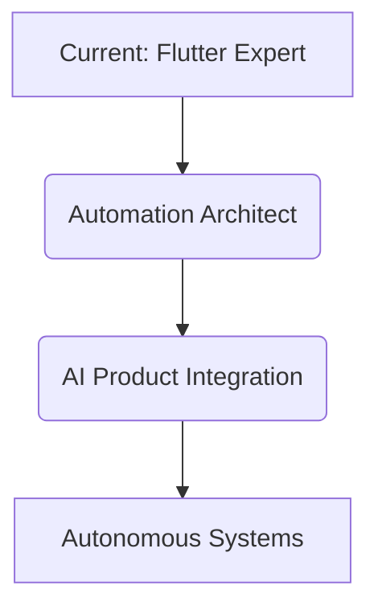

# Hi there 👋, I'm Hasan Abbas Sorathiya

💻 **Senior Software Engineer | Flutter Specialist | AI & Automation Architect**

---

<div align="center">

[](https://linkedin.com/in/hasanabbassorathiya)
[](https://flowcv.com/resume/pmesjl0q9sm9)

</div>

### 🚀 Professional Summary
Senior Software Engineer, 6+ years experience. Building/scaling mobile, full-stack apps. E-commerce, mobility, enterprise. Specialization: **Flutter**, **MERN**, **Cloud architecture**.

### 🛠️ Tech Stack
| Domain | Technologies |
| :--- | :--- |
| **Mobile** | Flutter, Dart, BLoC, Riverpod |
| **Backend** | Node.js, Express, MongoDB, Firebase |
| **Cloud/DevOps**| AWS (Lambda, ECS), GCP, Docker, Kubernetes, CI/CD |
| **AI/Auto** | n8n, LLM Integration (RAG), Python |

---

## 🧬 Identity Payload

```python
class SeniorEngineer(BaseModel):
    name: str = "Hasan Abbas Sorathiya"
    expertise: str = "Bridging deep AI capabilities with premium mobile experiences"

    focus_areas: List[str] = [
        "Scalable Mobile Architecture",
        "Agentic Workflows & Automation",
        "Cloud-Native Systems",
        "Full-stack Delivery"
    ]

    def ship(self) -> str:
        return "Build beautiful, automated, scalable systems."
```

---

### 📂 Public Projects
*   **[News_App](https://github.com/hasanabbassorathiya/News_App)**: Flutter news app.
*   **[Notes-by-Hasan](https://github.com/hasanabbassorathiya/Notes-by-Hasan)**: Flutter note-taking.
*   **[flutter_chat_ui](https://github.com/hasanabbassorathiya/flutter_chat_ui)**: Chat component.

## 🗺️ Growth Roadmap



---
*“I solve problems, automate boring stuff, build systems people love.”*

## 📈 GitHub Activity & Impact

<div align="center">


</div>
