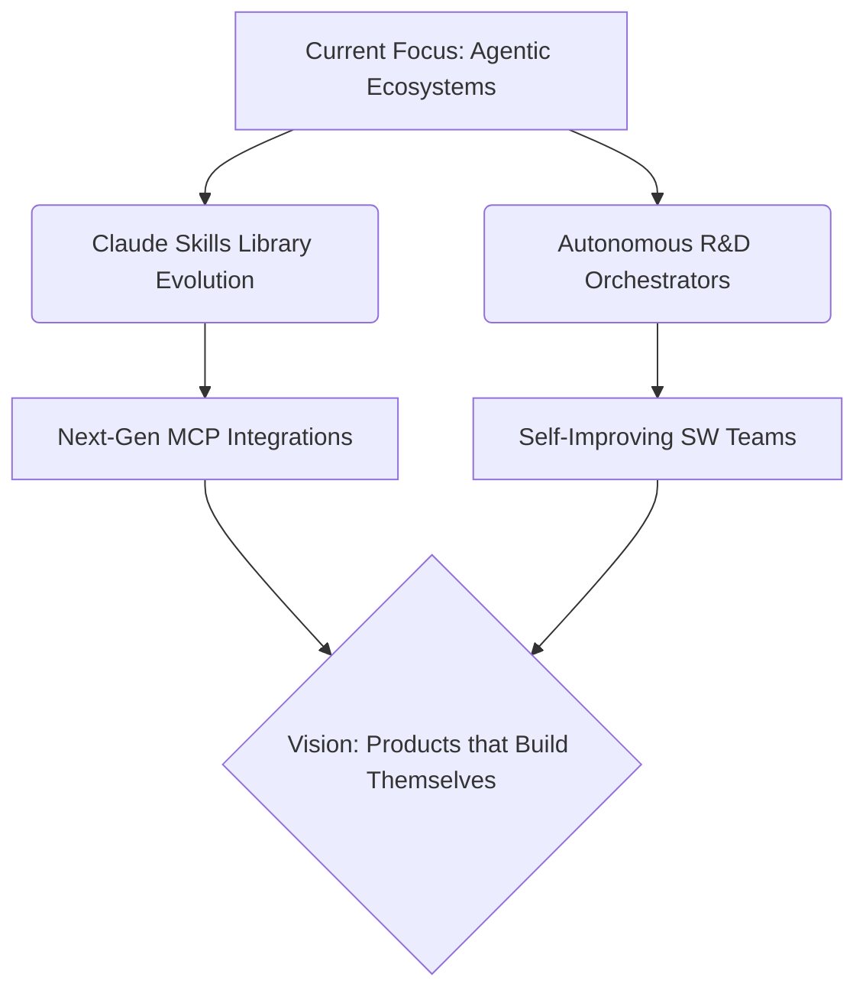

<div align="center">

<!-- HEADER IMAGE -->


<!-- TYPING BANNER -->
[](https://git.io/typing-svg)

[](https://github.com/alihusains)
[](https://linkedin.com/in/alihusains)
[](https://github.com/alihusains)

</div>

---

## 🌟 Flagship Project: Claude Skills Library

<div align="center">

[](https://alihusains.github.io/claude-skills/)

**[alihusains.github.io/claude-skills](https://alihusains.github.io/claude-skills/)**

*The ultimate production-ready AI coding plugin and orchestration library.*

| 🛠 248+ Skills | 🤖 23+ Agents | ⚙️ MCP Servers | 🔄 Autonomous R&D Loops |
| :---: | :---: | :---: | :---: |

> A comprehensive open-source workspace designed to turn AI assistants into fully autonomous software engineering teams. Featuring multi-agent swarms, self-improving loops, and premium design patterns.

</div>

---

## 🧬 Identity Payload

```python
from pydantic import BaseModel, Field
from typing import List, Dict

class AIProductManager(BaseModel):
    name: str = "Alihusain Sorathiya"
    superpower: str = "Bridging deep AI capabilities with breathtaking product experiences"

    focus_areas: List[str] = [
        "LLM-Powered Product Strategy",
        "Agentic Workflows & Multi-Agent Orchestration",
        "Model Context Protocol (MCP) Integration",
        "Autonomous R&D & Self-Improving Systems"
    ]

    stack: Dict[str, List[str]] = {
        "ai_tooling": ["Claude Code", "Cursor", "Aider", "Windsurf"],
        "engineering": ["Python", "Dart/Flutter", "TypeScript/JS", "Bash"],
        "architecture": ["Agent Swarms", "RAG Pipelines", "GitOps"]
    }

    def execute_vision(self) -> str:
        return "Ship products that think, plan, and act autonomously—without compromising on premium UI/UX."

# Initialize System
ali = AIProductManager()
ali.execute_vision()
```

---

## 🚀 About Me

I am an **Expert AI Product Manager** who operates at the bleeding edge of Generative AI, platform architecture, and premium user experience. I don't just write PRDs; I build the autonomous systems that write the code, review the architecture, and ship the product.

- 🧠 **Agentic Product Strategy** — Designing systems where LLMs plan, call tools, and execute complex software engineering workflows autonomously.
- 🎨 **Design Obsessed** — I believe AI tools shouldn't just be smart; they should be stunning. I champion glassmorphism, fluid animations, and premium frontend experiences.
- 🛠️ **Builder at Heart** — I maintain a massive ecosystem of 248+ production skills, actively coding in Python, Dart/Flutter, and TS.
- ⚙️ **Platform Orchestration** — Architecting Model Context Protocol (MCP) servers and autonomous R&D loops that continuously evolve codebases.

---

## 🧠 Tech Stack & AI Arsenal

**🤖 AI Tooling & Frameworks**


**💻 Engineering DNA**


**🛠 Platform & Product**


---

## 📈 GitHub Activity & Impact

<div align="center">


</div>

---

## 🗺️ Product Vision Roadmap



---

## 🤝 Let's Connect

<div align="center">

[](https://linkedin.com/in/alihusains)
[](https://github.com/alihusains)

</div>

<br/>

<!-- FOOTER WAVE -->


<div align="center">

### 💡 **"Building the intelligence layer of tomorrow's products."**

[](https://git.io/typing-svg)

</div>
